# IAMS — System Architecture & Algorithms Documentation Guide
# (Production Deployment — Supabase)

This guide walks you through documenting the **production** system architecture
and the algorithms/models used in IAMS after deployment to Supabase.

---

## PART 1 — System Architecture

### Step 1 — High-Level Production Architecture

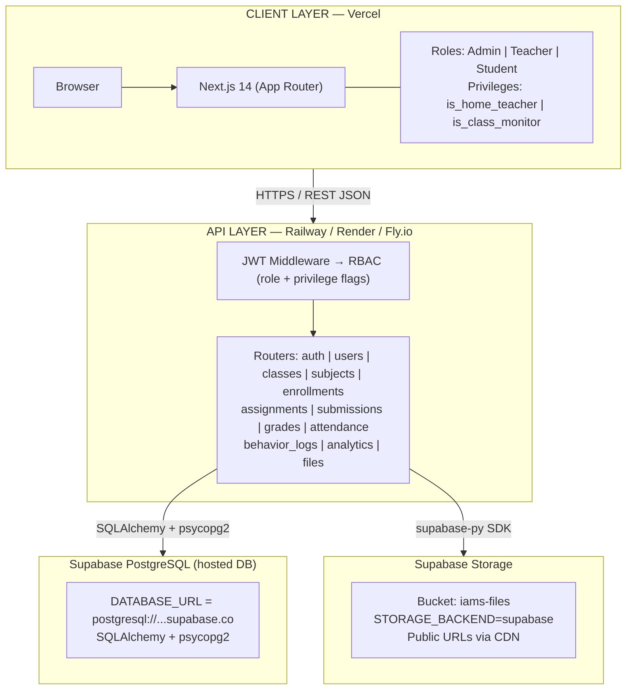

---

### Step 2 — Authentication & Token Flow

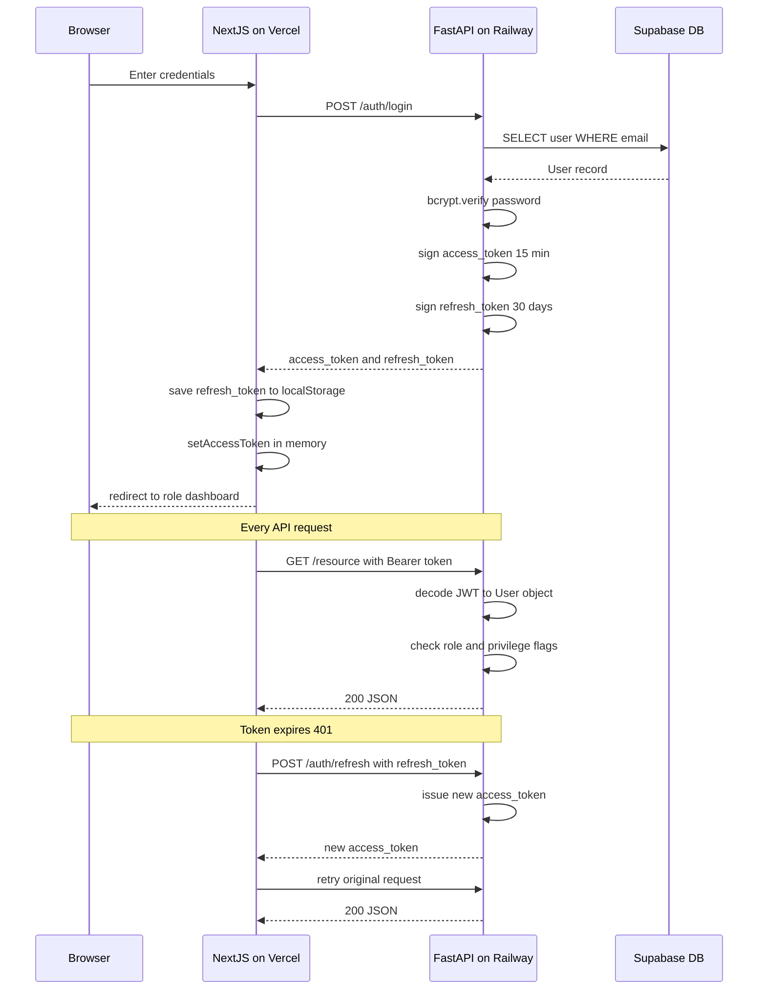

---

### Step 3 — Database ERD (Supabase PostgreSQL)

All tables live inside your Supabase project's PostgreSQL instance.

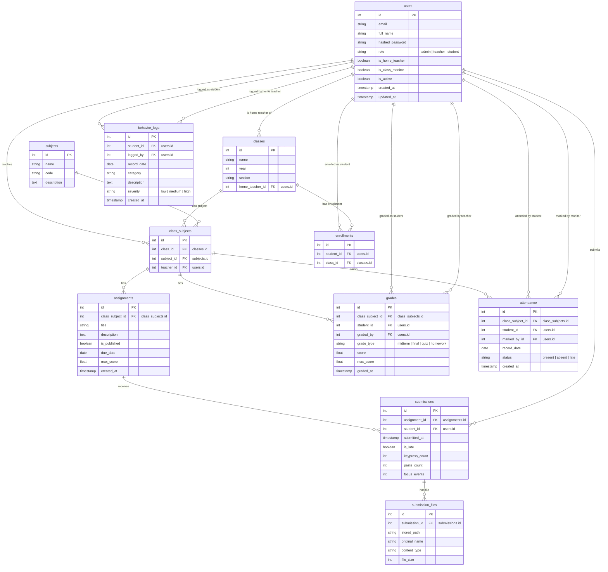

---

### Step 4 — Supabase Storage Flow

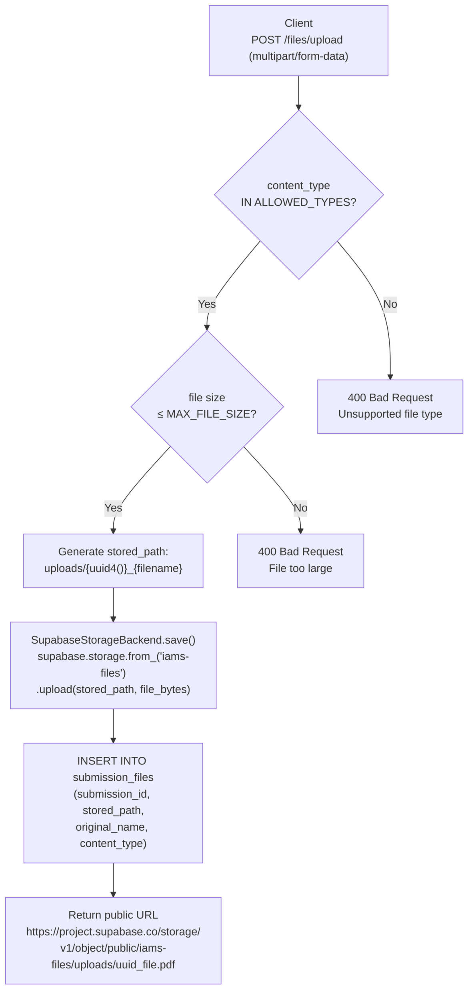

---

### Step 5 — Request Lifecycle Flowchart

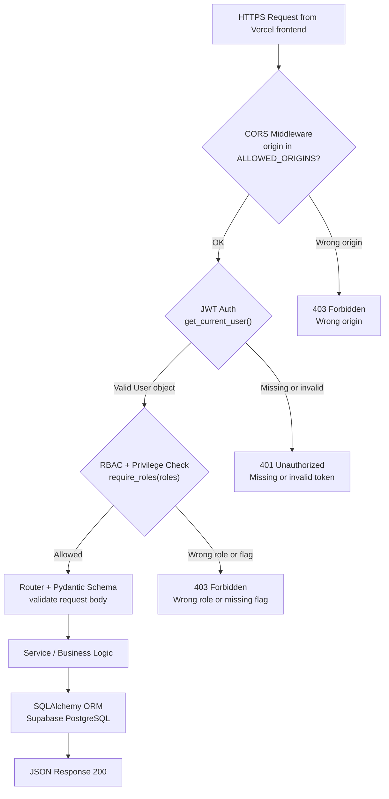

---

### Step 6 — Frontend Component Architecture (Vercel / Next.js)

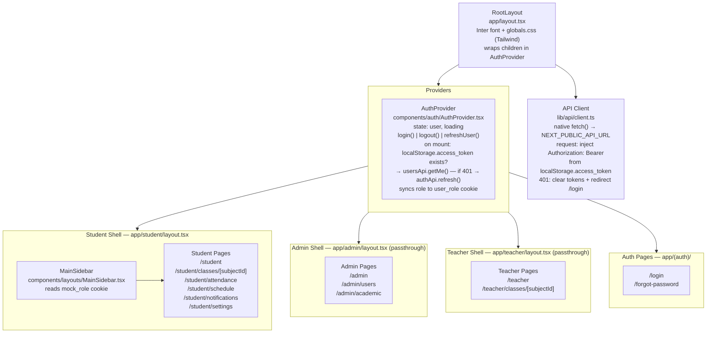

---

### Step 7 — Environment Variables (Production)

These are set in your hosting dashboards, not in `.env` files:

**FastAPI host (Railway / Render):**
```env
DATABASE_URL              = postgresql://postgres.<ref>:<pass>@aws-0-<region>.pooler.supabase.com:5432/postgres
JWT_SECRET_KEY            = <256-bit random secret>
STORAGE_BACKEND           = supabase
SUPABASE_URL              = https://<project-ref>.supabase.co
SUPABASE_SERVICE_ROLE_KEY = <service_role_key from Supabase dashboard>
SUPABASE_STORAGE_BUCKET   = iams-files
ALLOWED_ORIGINS           = https://your-app.vercel.app
DEBUG                     = false
ENVIRONMENT               = production
```

**Next.js (Vercel):**
```env
NEXT_PUBLIC_API_URL = https://your-fastapi.railway.app
```

---

## PART 2 — Algorithms & Models

### Step 8 — Authentication Algorithm (bcrypt + JWT)

**Password hashing:**
```
Registration:
  raw_password → passlib.bcrypt.hash(password) → stored in users.hashed_password

Login:
  passlib.bcrypt.verify(raw_password, hashed_password) → True / False
```

**JWT generation:**
```python
# Claims included in BOTH access and refresh tokens:
token_claims = {
  "sub": str(user.id),
  "role": user.role.value,          # "admin" | "teacher" | "student"
  "is_home_teacher": bool,          # privilege flag
  "is_class_monitor": bool,         # privilege flag
}

access_token payload  = token_claims + {"exp": now + timedelta(minutes=15), "type": "access"}
refresh_token payload = token_claims + {"exp": now + timedelta(days=30),    "type": "refresh"}

token = jose.jwt.encode(payload, JWT_SECRET_KEY, algorithm="HS256")
```

**Token validation (`get_current_user` dependency):**
```python
payload = jose.jwt.decode(token, JWT_SECRET_KEY, algorithms=["HS256"])
# Returns {} on JWTError — treated as invalid

user_id    = payload.get("sub")
token_type = payload.get("type")

if not user_id or token_type != "access":
    raise HTTP 401 Unauthorized

user = db.query(User).filter(User.id == user_id, User.is_active == True).first()
if not user:
    raise HTTP 401 Unauthorized

return user   # user.is_home_teacher / user.is_class_monitor available for RBAC
```

Source: `backend/app/core/security.py`, `backend/app/services/auth_service.py`

---

### Step 9 — RBAC + Privilege Algorithm

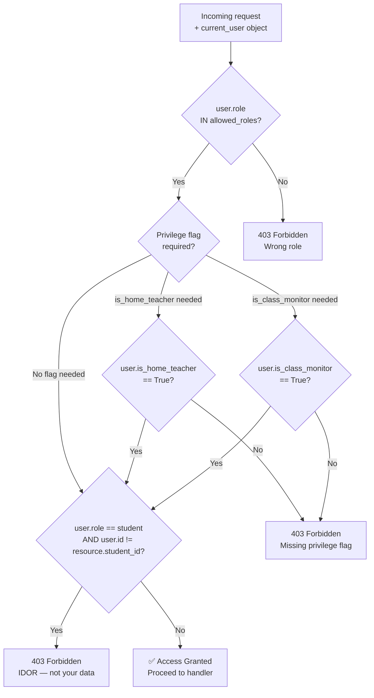

**Permissions table:**

| Endpoint            | admin | teacher | teacher + is_home_teacher | student | student + is_class_monitor |
| ------------------- | ----- | ------- | ------------------------- | ------- | -------------------------- |
| POST /classes       | ✅    | ❌      | ❌                        | ❌      | ❌                         |
| GET /classes        | ✅    | ✅      | ✅                        | ✅      | ✅                         |
| POST /attendance    | ❌    | ❌      | ❌                        | ❌      | ✅                         |
| POST /behavior_logs | ❌    | ❌      | ✅                        | ❌      | ❌                         |
| GET /analytics      | ✅    | ✅      | ✅                        | ❌      | ❌                         |

Source: `backend/app/core/permissions.py`

---

### Step 10 — Grade Calculation Algorithm

Grades are **submission-based**: a `Grade` record is linked to an `AssignmentSubmission`, not directly to a student + class_subject. Each `Assignment` may optionally belong to a `GradeCategory` (teacher-defined, dynamic weights).

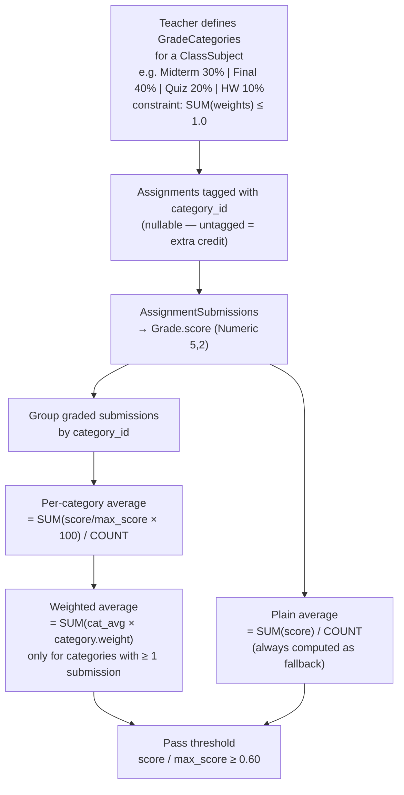

**Algorithm (Python):**
```python
# In GET /analytics/student/{id}/score-trend
by_cat = defaultdict(list)
for grade, submission, assignment in rows:
    if assignment.category_id and assignment.category_id in cat_map:
        pct = grade.score / assignment.max_score * 100
        by_cat[assignment.category_id].append(pct)

weighted_average = sum(
    (sum(scores) / len(scores)) * float(cat_map[cat_id].weight)
    for cat_id, scores in by_cat.items()
)   # None if no categorised submissions

plain_average = sum(grade.score for ...) / count
```

**Grade letter thresholds** (applied to the weighted or plain average as a percentage):
```
≥ 90 → A  |  ≥ 80 → B  |  ≥ 70 → C  |  ≥ 60 → D  |  < 60 → F
```

Source: `backend/app/routers/analytics.py`, `backend/app/routers/grade_categories.py`, `backend/app/models/grade_category.py`

---

### Step 11 — Attendance Rate Algorithm

The `AttendanceStatus` enum has four values: `present`, `late`, `absent`, `excused`.
`excused` absences count as fully present (student had a valid reason).

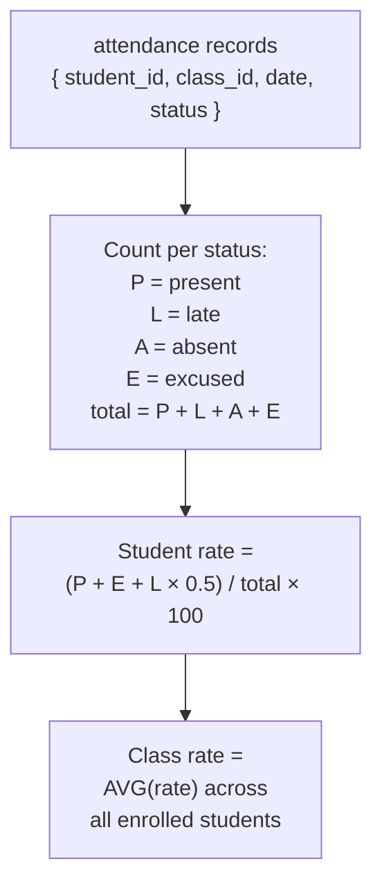

**Formula:**
```
attendance_rate = (present + excused + late × 0.5) / total_records × 100
```

Returned in `GET /analytics/student/{id}/score-trend` as the `attendance_rate` field.

Source: `backend/app/routers/analytics.py`, `backend/app/models/attendance.py`

---

### Step 12 — File Upload Algorithm (Supabase Storage)

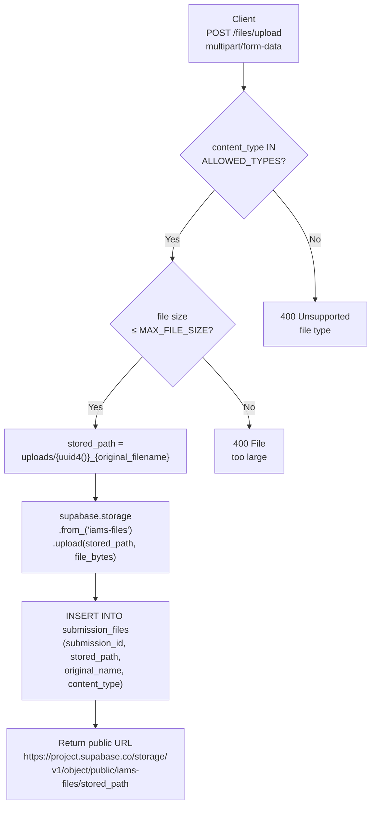

**ALLOWED_TYPES** (`ALLOWED_TYPES` set in `files.py`):
```
image/jpeg
image/png
image/gif
text/plain
application/pdf
application/msword                                                      (.doc)
application/vnd.openxmlformats-officedocument.wordprocessingml.document (.docx)
application/vnd.openxmlformats-officedocument.spreadsheetml.sheet       (.xlsx)
```

**Storage backend selection** (`STORAGE_BACKEND` env var):
```
STORAGE_BACKEND=local    → LocalFilesystemBackend  (default, dev)
STORAGE_BACKEND=supabase → SupabaseStorageBackend  (production)
```

Source: `backend/app/routers/files.py`, `backend/app/storage/local.py`, `backend/app/storage/supabase.py`

---

### Step 13 — Analytics Aggregation

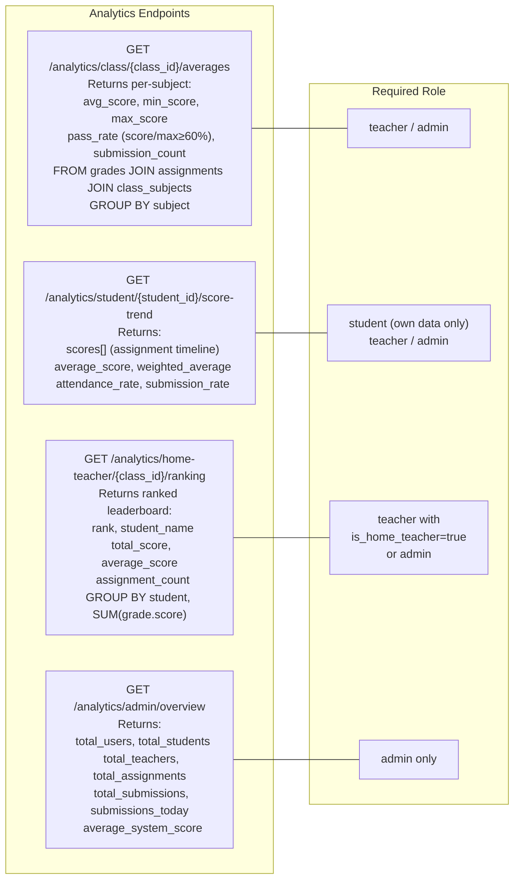

Source: `backend/app/routers/analytics.py`

---

## PART 3 — Putting It All Together

### Final Document Structure

```
1. System Architecture (Production)
   1.1 High-Level Production Architecture (Step 1)
   1.2 Authentication & Token Flow (Step 2)
   1.3 Database ERD — Supabase PostgreSQL (Step 3)
   1.4 Supabase Storage Flow (Step 4)
   1.5 Request Lifecycle Flowchart (Step 5)
   1.6 Frontend Component Architecture — Vercel (Step 6)
   1.7 Environment Variables (Step 7)

2. Algorithms & Models
   2.1 Authentication — bcrypt + JWT (Step 8)
   2.2 RBAC + Privilege Flags (Step 9 + table)
   2.3 Grade Calculation (Step 10)
   2.4 Attendance Rate (Step 11)
   2.5 File Upload — Supabase Storage (Step 12)
   2.6 Analytics Aggregation (Step 13)
```

---

## Checklist

- [ ] Step 1 — Production 4-layer architecture diagram (Vercel + Railway + Supabase DB + Supabase Storage)
- [ ] Step 2 — Auth token flow sequence diagram
- [ ] Step 3 — Database ERD (all 11 tables in Supabase PostgreSQL)
- [ ] Step 4 — Supabase Storage file upload flow
- [ ] Step 5 — Request lifecycle flowchart
- [ ] Step 6 — Frontend component architecture (Vercel / Next.js)
- [ ] Step 7 — Production environment variables listed
- [ ] Step 8 — bcrypt + JWT algorithm documented
- [ ] Step 9 — RBAC + privilege algorithm + permissions table
- [ ] Step 10 — Grade calculation formula
- [ ] Step 11 — Attendance rate formula
- [ ] Step 12 — File upload algorithm (Supabase Storage path)
- [ ] Step 13 — Analytics aggregation endpoints
